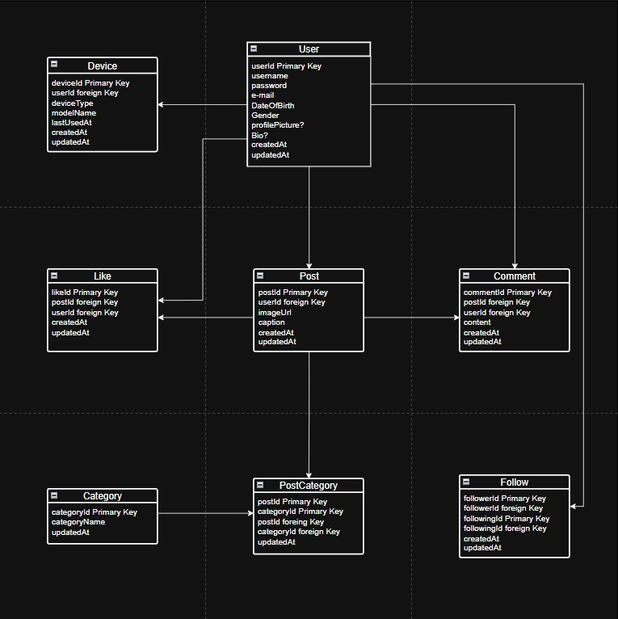

# 🧠 YUSUFGRAM

A social media app allowing users to register, log in, share images with captions, interact via likes and comments, and personalize their profile with a picture and bio.

---

## ⚙️ Technologies

- **NestJS** → Backend framework  
- **Express** → HTTP server (used under NestJS)  
- **PostgreSQL** → Database  
- **TypeORM** → ORM (between NestJS and database)  
- **dotenv** → Environment variable management  
- **bcrypt** → Password hashing  
- **jsonwebtoken (JWT)** → Authentication / token management
- **Redis** → Speed for posts
- **Socket.io** → Real Time Application  
- **class-validator** → DTO validation  
- **class-transformer** → DTO and entity transformation  

---

## 🧩 ENTITIES

### **User**
| Field | Type |
|-------|------|
| userId | Generated primary key |
| username | string |
| password | string |
| email | string |
| DateOfBirth | date | 
| Gender | string |
| profilePicture | Optional default |
| Bio | Optional string |
| createdAt | datetime |
| updatedAt | datetime |

---

### **Post**
| Field | Type |
|-------|------|
| postId | Generated primary key |
| userId | foreign key |  
| imageUrl | string |  
| caption | string |  
| createdAt | datetime |  
| updatedAt | datetime |  

---

### **Comment**
| Field | Type | 
|-------|------|
| commentId | Generated primary key |  
| postId | foreign key |  
| userId | foreign key |  
| content | string |  
| createdAt | datetime |  
| updatedAt | datetime |  

---

### **Like**
| Field | Type | 
|-------|------|
| likeId | Generated primary key |  
| postId | foreign key |  
| userId | foreign key | 
| createdAt | datetime |  
| updatedAt | datetime |  

---

### **Category**
| Field | Type |
|-------|------|
| categoryId | Generated primary key |  
| categoryName | string |  
| updatedAt | datetime |  

---

### **PostCategory**
| Field | Type | 
|-------|------|
| postId | primary key, foreign key |  
| categoryId | primary key, foreign key |  
| updatedAt | datetime |  

---

### **Follow**
| Field | Type | 
|-------|------|
| followerId | primary key , foreign key|  
| followingId | primary key , foreign key |
| createdAt | datetime | 
| updatedAt | datetime | 

---

### **Device**
| Field | Type |
| :--- | :--- |
| **deviceId** | Generated primary key |
| **userId** | Foreign Key |
| **deviceType** | string |
| **modelName** | string |
| **lastUsedAt** | datetime |
| **createdAt** | datetime |
| **updatedAt** | datetime |

### **Notification**
| Field | Type |
|-------|------|
| notificationId | Generated primary key |
| userId | Foreign key → User |
| actorId | Foreign key → User |
| type | Enum (LIKE, COMMENT, FOLLOW) |
| postId | Foreign key → Post (Optional) |
| isRead | Boolean (default: false) |
| createdAt | datetime |

---

#### Table of All Entities

## 🚀 ENDPOINTS

### **AUTH**

#### DTOs

**LoginRequestDto:**
- Username (string)
- Password (string) 

**LoginResponseDto:**
- Token (string)  
- Message (string)  

**RegisterRequestDto:**
- Username (string)  
- Password (string) 
- E-mail (string)  
- DateOfBirth (date)  
- Gender (string)  

**RegisterResponseDto:**
- Token (string)  
- Message (string)  

#### Routes

`POST /auth/login`  
**Request:** `LoginRequestDto`  
**Response:** `LoginResponseDto`

`POST /auth/register`  
**Request:** `RegisterRequestDto`  
**Response:** `RegisterResponseDto`

---

### **USER**

**UserDataResponseDto:**  
userId (int), username (string), password (string), email (string), DateOfBirth (date), Gender (string), profilePicture (string), Bio (string)  

**UserMessageResponseDto:**  
Message (string)  

**UserUpdateRequestDto:**  
- Username? (string)  
- Bio? (string)  
- profilePicture? (string)  

**UserPasswordUpdateRequestDto:**  
- oldPassword (string)  
- newPassword (string)  

#### Routes

`GET /user/:userId`  
**Response:** `UserDataResponseDto`

`GET /user/:username`  
**Response:** `UserDataResponseDto`

`DELETE /user/:userId`  
**Response:** `UserMessageResponseDto`

`PUT /user/:userId`  
**Request:** `UserUpdateRequestDto`  
**Response:** `UserMessageResponseDto`

`PUT /user/changePassword/:userId`  
**Request:** `UserPasswordUpdateRequestDto`  
**Response:** `UserMessageResponseDto`

---

### **POST**

**PostRequestDto:**  
- imageUrl (string)  
- caption? (string)  

**PostResponseMessageDto:**  
- Message (string)  

**GetPostResponseDto:**  
- postId (int), userId (int), imageUrl (string), caption (string), createdAt (date), updatedAt (date)  

**PostUpdateRequestDto:**  
- imageUrl? (string)  
- caption? (string)  

#### Routes

`GET /posts/:postId`  
**Response:** `GetPostResponseDto`

`GET /posts`  
**Response:** `GetPostResponseDto`

`POST /posts`  
**Request:** `PostRequestDto`  
**Response:** `PostResponseMessageDto`

`GET /posts/:userId/posts`  
**Response:** `GetPostResponseDto`

`PUT /posts/:postId`  
**Request:** `PostUpdateRequestDto`  
**Response:** `PostResponseMessageDto`

`DELETE /posts/:postId`  
**Response:** `PostResponseMessageDto`

`GET /posts/feed`  
**Response:** `GetPostResponseDto`

---

### **LIKE**

**likeResponseMessageDto:**  
- Message (string)  

**likeResponseDto:**  
- likeId (int)  
- postId (int)   
- userId (int)   
- createdAt (date)   
- updatedAt (date)   

#### Routes

`POST /posts/:postId/like`  
**Response:** `likeResponseMessageDto`

`DELETE /posts/:postId/like`  
**Response:** `likeResponseMessageDto`

`GET /posts/:postId/likes`  
**Response:** `likeResponseDto`

---

### **COMMENTS**

**PostCommentRequestDto:**  
- Content (string)   

**PostCommentResponseDto:**  
- Message (string)  

**GetCommentResponseDto:**  
- commentId (int)   
- postId (int)   
- userId (int)   
- content (string)   
- createdAt (date)   
- updatedAt (date)   

**UpdateCommentRequestDto:**  
- Content? (string)    

#### Routes

`POST /posts/:postID/comments`  
**Request:** `PostCommentRequestDto`  
**Response:** `PostCommentResponseDto`

`GET /posts/:postId/comments`  
**Response:** `GetCommentResponseDto`

`PUT /posts/:postID/:commentId`  
**Request:** `UpdateCommentRequestDto`  
**Response:** `PostCommentResponseDto`

`DELETE /comments/:commentId`  
**Response:** `PostCommentResponseDto`

---

### **FOLLOW**

**FollowUserResponseDto:**
- followerId (number)   
- followingId (number)   
- Message (string)

**UnfollowUserResponseDto:**
- followerId (number)   
- followingId (number)   
- Message (string)

**FollowersCountResponseDto:**
- userId (number)   
- followersCount (number)

**FollowingCountResponseDto:**
- userId (number)   
- followingCount (number)
  

#### Routes

`POST /follow/:userId/follow`  
**Response:** `FollowUserResponseDto`  

`DELETE /follow/:userId/unfollow`  
**Response:** `UnfollowUserResponseDto`  

`GET /users/:userId/followers/count`  
**Response:** `FollowersCountResponseDto`  

`GET /users/:userId/following/count`  
**Response:** `FollowingCountResponseDto`  

  
## 📝 TO DO LIST

- **Versioning**
- **Skip and Limit Parametres**

---
   
## 🧱 MIDDLEWARES

- **TokenCheck**
- **DeviceTrackingGuard**

---

## 🧰 UTILS

- **generateJwtToken**  
- **hashPassword**  
- **comparePassword**
- **refreshToken**

---
